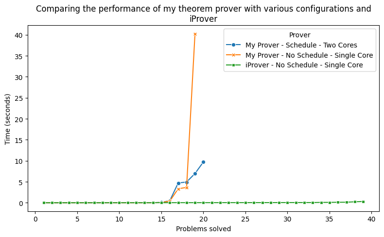
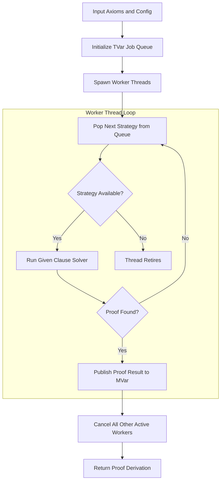

# Theorem-Prover

A First-Order Logic automated theorem prover written in **Haskell**. This tool implements the **Given Clause Algorithm** to determine the unsatisfiability of a set of axioms.

## Prelimenary Results 



| Prover | Number of Problems Solved | Average Solve Time on Solved Instances|
| :--- | :--- | :--- |
| My Prover - No Schedule - Single Core | 19 | 2.5197s |
| My Prover - Schedule - Two Cores | 20 | 1.3575s |  
| iProver | 39 | 0.0498s | 
| 

NOTE: A 60 second time limit was used when gathering these results 

NOTE: These results were gathered using a subset of the PUZ TPTP set that does not use equality or references to axiom files, because our prover does not support this yet.

NOTE: The config files used for my prover can be found in configs/.

NOTE: iProver was ran with no schedule, using its default configuration and a single core.

Config for my prover
```json
{
  "totalTimeLimit": 60,
  "threads": 1,
  "schedule": [
    {
      "filterFunction": [
        "RemoveTautologies",
        "ForwardSubsumption"
      ],
      "stopAfterNSteps": null,
      "passiveQueues": [
        {
          "pqTypeConfig": "Age",
          "weightConfig": 1
        },
        {
          "pqTypeConfig": "Weight",
          "weightConfig": 10
        }
      ],
      "timeLimit": null
    }
  ]
}
```

iProver Args Used 
```bash
iproveropt --schedule none
```


## Installation & Setup

### Prerequisites
* [GHC (Glasgow Haskell Compiler)](https://www.haskell.org/ghcup/) 9.4.8 or later.
* [Cabal](https://www.haskell.org/cabal/) build tool.
* Python 3.10.12 (for evaluation scripts)


### Build
From the project root, run:
```bash
cabal update
cabal build
```

To add the prover to your PATH run: 
```bash 
cabal install --overwrite-policy=always
```

Then run 
```bash
Theorem-Prover <INPUT_FILE> [FLAGS]
```


## Usage

### Command Line Interface

```bash
Theorem-Prover <INPUT_FILE> [FLAGS]
```

#### Input Files
The prover accepts TPTP format files in clausal normal form (CNF). Input files should use the `.p` extension and contain clauses in the TPTP `cnf` format. The prover does not currently support equality (the `=` operator) or problems that reference external axiom files via `include()` directives.

#### Flags

| Flag | Description |
| :--- | :--- |
| `-c, --config FILE` | Path to a JSON configuration file. If omitted, uses the default configuration. |
| `-o, --output FILE` | Path to save proof derivation output. |

#### Output Behavior

| Output Destination | Result |
| :--- | :--- |
| Stdout (no `-o` flag) | Outputs True for Unsatisfiable and False for Satisfiable |
| Output file | Saves proof derivation to the specified file if it is found |


### Scheduler

The prover includes a parallel **scheduler** ([src/Scheduler.hs](src/Scheduler.hs)) that enables trying multiple proof search strategies concurrently across multiple threads. By running diverse strategies in parallel, the prover can explore different parts of the search space simultaneously to find proofs faster.

#### How the Scheduler Works

1. **Job Queue Initialization**: A thread-safe queue (`TVar`) is initialized containing all strategies specified in the `schedule` list of the configuration.
2. **Parallel Worker Pool**: The scheduler spawns `threads` worker threads. Each thread pops the next strategy off the shared queue and runs the Given Clause Loop solver ([src/GivenClauseLoop/Solver.hs](src/GivenClauseLoop/Solver.hs)).
3. **Strategy Termination & Handover**: If a strategy hits its individual `timeLimit` or `stopAfterNSteps` without finding unsatisfiability, the thread completes that strategy execution and automatically pulls the next strategy from the queue.
4. **Early Proof Cancellation**: When any worker thread successfully derives `False` (unsatisfiability) or saturates the search space (satisfiability), it publishes the final proof state to a shared synchronization variable (`MVar`) and immediately cancels all other active worker threads.
5. **Global Wall-Clock Timeout**: The top-level `totalTimeLimit` imposes a strict global timeout (in seconds) across all threads. If no strategy finds a proof within this time limit, execution terminates gracefully.

#### Scheduler Architecture Flowchart




### Configuration

The prover behavior can be customized via a JSON configuration file. If no config is specified, the default configuration is used.

#### Config File Format

```json
{
  "totalTimeLimit": 30,
  "threads": 2,
  "schedule": [
    {
      "filterFunction": [
        "RemoveTautologies",
        "ForwardSubsumption"
      ],
      "stopAfterNSteps": null,
      "passiveQueues": [
        {
          "pqTypeConfig": "Age",
          "weightConfig": 5
        },
        {
          "pqTypeConfig": "Weight",
          "weightConfig": 1
        }
      ],
      "timeLimit": 30
    },
    {
      "filterFunction": [
        "RemoveTautologies",
        "ForwardSubsumption"
      ],
      "stopAfterNSteps": null,
      "passiveQueues": [
        {
          "pqTypeConfig": "Age",
          "weightConfig": 10
        },
        {
          "pqTypeConfig": "Weight",
          "weightConfig": 1
        }
      ],
      "timeLimit": 30
    }
  ]
}
```

#### Configuration Options

##### Top-Level Configuration (`ProofSearchConfig`)

- **`totalTimeLimit`** (integer or `null`): global timeout (in seconds) for the entire prover execution across all threads. `null` means no global timeout.
- **`threads`** (integer): Number of parallel worker threads spawned to execute jobs from the schedule queue.
- **`schedule`** (array of strategy objects): List of strategy configurations (`SingleProofSearchOptions`) to be executed.

##### Strategy Configuration (`SingleProofSearchOptions`)

- **`filterFunction`** (array of strings): List of filtering strategies applied to newly derived clauses. Available filters:
  - `RemoveTautologies`: Discards tautologies (e.g. `p(X) | ~p(X)`).
  - `ForwardSubsumption`: Discards clauses that are subsumed by previously derived clauses.
  - `NoFilter`: Discards zero clauses.
  - Filters are combined with logical AND; a clause is kept only if accepted by all specified filters.

- **`stopAfterNSteps`** (integer or `null`): Maximum Given clause loop iterations for this strategy before terminating and moving to the next job. `null` means no step limit.

- **`passiveQueues`** (array of queue configurations): Defines priority queues for ordering passive clauses. Clauses are selected from each queue in turn according to their assigned weight.
  - **`pqTypeConfig`**: Priority strategy (`"Age"` for derivation order, `"Weight"` for syntactic symbol count).
  - **`weightConfig`**: Number of clauses selected from this queue before switching to the next queue.

- **`timeLimit`** (float/integer or `null`): timeout (in seconds) for this individual strategy execution. `null` means no per-strategy time limit.


### Examples

#### Basic unsatisfiability check
```bash
Theorem-Prover PUZ001-1.p
```

#### With custom configuration
```bash
Theorem-Prover problem.p --config myconfig.json
```

#### Save output to file
```bash
Theorem-Prover problem.p --output proof.txt
```

#### All options together
```bash
Theorem-Prover problem.p -c config.json -o proof.txt
```


## Algorithm Implementation

### Given Clause Loop

The core solving algorithm is implemented in [src/GivenClauseLoop/Solver.hs](src/GivenClauseLoop/Solver.hs). The loop operates as follows:

1. **Initialization**: Start with input clauses in the passive queue(s)
2. **Selection**: Select a clause from the passive queues using the configured priority strategy
3. **Saturation Check**: If no clause can be selected, the formula is satisfiable; terminate
4. **Inferences**: Perform all possible inferences (resolution and factorization) with the given clause against active clauses
5. **Filtering**: Apply filtering rules to newly derived clauses (tautology removal, subsumption checks)
6. **Active Set Update**: Move the given clause to the active set
7. **Repeat**: Return to step 2 until we derive False or the step limit is reached


### Resolution

Implemented in [src/Resolution.hs](src/Resolution.hs). Resolution is the primary inference rule:

**Rule**: From clauses `C1 | l` and `C2 | ¬l'` where `l` and `l'` unify under substitution `σ`, derive the **resolvent**: `σ(C1) | σ(C2)`

The implementation:
1. Identifies pairs of literals with opposing polarities from two clauses
2. Attempts unification on each pair
3. For successful unifications, removes the unified literals and combines remaining literals
4. Returns all derived clauses

### Factorization

Implemented in [src/Factoring.hs](src/Factoring.hs). Factorization simplifies clauses with redundant literals:

**Rule**: From clause `l | l' | C` where `l` and `l'` unify under substitution `σ`, derive: `σ(l) | σ(C)`

The implementation:
1. Identifies pairs of literals with the **same polarity** in a clause
2. Attempts unification on each pair
3. For successful unifications, removes one of the unified literals
4. Returns all derived clauses

### Unification

Implemented in [src/Unification.hs](src/Unification.hs). Unification finds variable substitutions making terms or predicates identical:

**Key Functions**:
- `unifyTerms`: Robinson's unification algorithm for terms
- `unifyPredicates`: Unifies predicate arguments
- `unifyingPairs`: Filters literal pairs that unify successfully
- `standardiseApart`: Renames variables in clauses to ensure no variable appears in two input clauses simultaneously


### Subsumption

Implemented in [src/Subsumption/Subsumption.hs](src/Subsumption/Subsumption.hs). Subsumption eliminates redundant clauses:

**Definition**: Clause `C` **subsumes** clause `D` if there exists a substitution `σ` such that `σ(C) ⊆ D` (every literal in the substituted `C` appears in `D`)

**Consequence**: If `C` subsumes `D`, any model satisfying `D` also satisfies `C`, so `D` is redundant and can be removed.

**Implementation**:
- [src/Subsumption/SubsumptionFilter.hs](src/Subsumption/SubsumptionFilter.hs) implements a **clause trie** (feature-vector indexed tree) to efficiently retrieve potentially subsuming clauses
- Feature vectors extract symbol information from clauses, enabling quick filtering of candidate subsumers
- `canMatch`: Checks if one clause's literals can match another's under substitution
- `isSubsumedBy`: Performs full subsumption checking with variable binding
- `matchLiterals`, `matchTerms`: Recursive matching algorithms

**Forward Subsumption Filter**: The `ForwardSubsumption` filter in [src/Filtering.hs](src/Filtering.hs) prevents retention of subsumed clauses, improving search efficiency.


## Testing

### Unit Tests

Run the comprehensive test suite:

```bash
cabal test
```

The test suite covers the following components:

- **CNF Conversion** ([test/CNFTests.hs](test/CNFTests.hs)): Clause normalization and CNF transformation
- **NNF Transformation** ([test/NNFTests.hs](test/NNFTests.hs)): Negation Normal Form preprocessing
- **Prenex Transformation** ([test/PrenexTests.hs](test/PrenexTests.hs)): Quantifier standardization and prenex form
- **Skolemization** ([test/SkolemTests.hs](test/SkolemTests.hs)): Existential quantifier elimination and Skolem functions
- **Simplification** ([test/SimplificationTests.hs](test/SimplificationTests.hs)): Formula simplification and redundancy removal
- **Resolution Inference** ([test/Resolution/](test/Resolution/)): 
  - `ResolveTests.hs`: Core resolution inference rule
  - `OpposingPolarityPairsTests.hs`: Literal pairing for resolution
  - `ApplyResolutionTests.hs`: Application of substitutions during resolution
  - `RunResolutionTests.hs`: Integration tests
- **Factorisation Inference** ([test/Factoring/](test/Factoring/)):
  - `FactoriseTests.hs`: Core factorization rule
  - `SamePolarityPairsTests.hs`: Same-polarity literal detection
  - `ApplyFactorisationTests.hs`: Substitution application during factorization
  - `RunFactoringTests.hs`: Integration tests
- **Subsumption** ([test/Subsumption/](test/Subsumption/)):
  - `IsSubsumedByTests.hs`: Clause subsumption checking
  - `CanMatchTests.hs`: Literal matching under substitution
  - `MatchLiteralsTests.hs`: Predicate literal matching
  - `ExtractSymbolsFromClauseTests.hs`: Feature vector extraction
  - `GetFeatureVectorTests.hs`: Feature vector computation
  - `GetSymbolOrderTests.hs`: Symbol ordering for feature vectors
  - `GroundClauseTests.hs`: Clause grounding for subsumption checks
  - `InsertInClauseTrieTests.hs`: Trie insertion and indexing
  - Other specialized subsumption tests
- **Unification** ([test/Unification/](test/Unification/)): Variable substitution, occurs check, and unification algorithms
- **Substitution** ([test/Substitution/](test/Substitution/)): Term and formula substitution operations
- **Binary Signature Tests** ([test/BinaryTests.hs](test/BinaryTests.hs)) ([test/ModTests.hs](test/ModTests.hs)): Tests containing a signature with only two constants 0 and 1

Some tests particularly the ones concerning simplification and binary signatures were taken from the book Handbook of Practical Logic and Automated Reasoning.

Consult the test logs to see detailed results.

## Evaluation

Also included are a set of python scripts to evaluate the prover on sets of problems in the tptp format. 
Currently, there is no support for equality, and though there is code to convert problems to clausal form, the current prover assumes the problems are already in clausal form. For this reason we test on a subset of the PUZ problem set from the TPTP library. These problems contain no equality, and no references to axiom files. 

Consult the python scripts in `./evaluation` to evalaute the prover. 

## Todo 

- Add support for equality through superposition
- Extend parser to support FOF format
- Improve testing infrastructure

## References

```bibtex
@inbook{Harrison_2009, 
  place={Cambridge}, 
  title={First-order logic}, 
  booktitle={Handbook of Practical Logic and Automated Reasoning}, 
  publisher={Cambridge University Press}, 
  author={Harrison, John}, 
  year={2009}, 
  pages={118–234}
}

@article{Korovin_2008,
  title={iProver—an instantiation-based theorem prover for first-order logic},
  author={Korovin, Konstantin},
  journal={IJCAR},
  pages={292--298},
  year={2008}
}

@misc{Sutcliffe_TPTP,
  title={The TPTP Problem Library and Associated Infrastructure},
  author={Sutcliffe, Geoff},
  note={Available at \url{https://www.tptp.org/}},
  year={Accessed 2025}
}
```